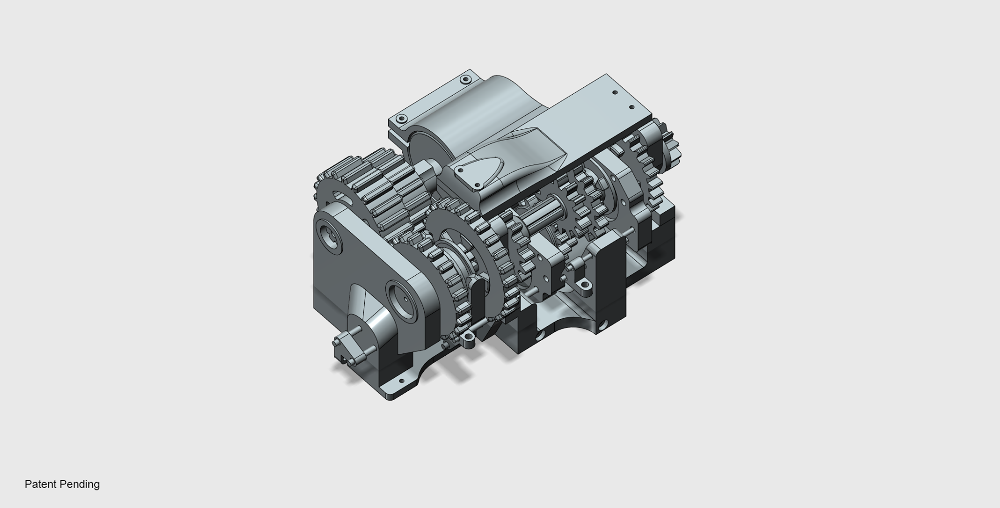

# GearShiftControl
An Android App made for demonstrating the functions of a gear shifting gearbox. The UI is scaled for 1080 X 1920: 420dpi resolution. The demonstration of this App interacting with the gearbox can be watched in the follwoing link.

https://www.facebook.com/watch/?v=112726750155013

